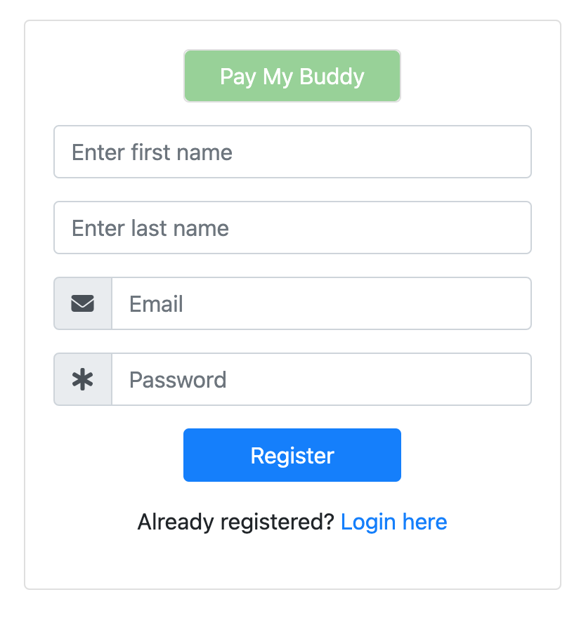
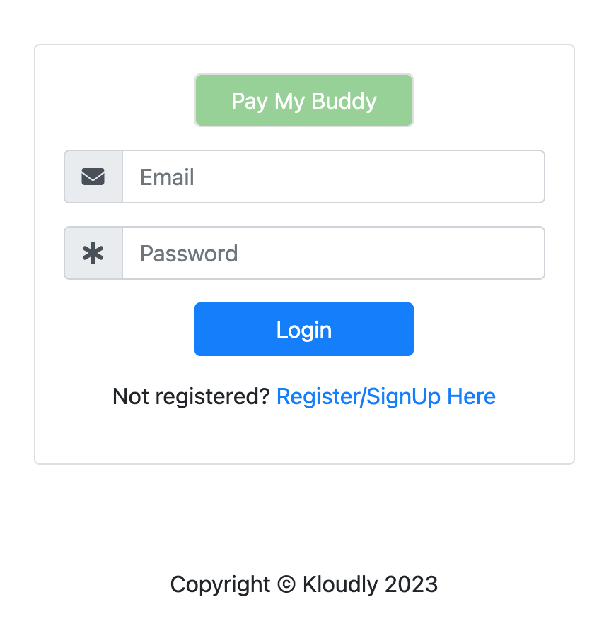
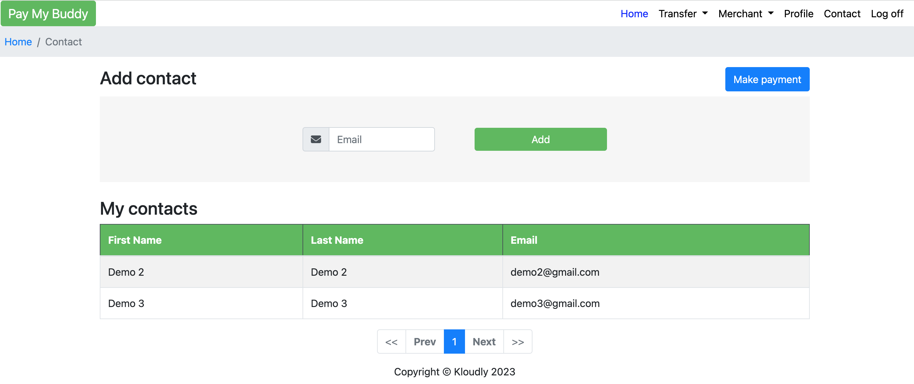
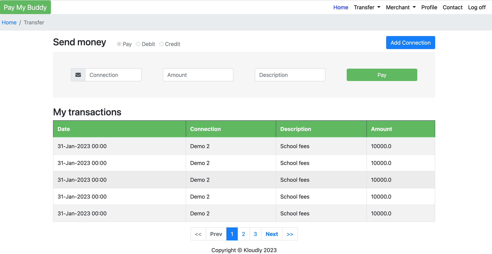

Pay my buddy is a fund transfer app to manage your daily financial transactions with your contacts.


## Features
Pay My Buddy provides the following features:
- User registration / Login
- Adding new contact
- Top up / Top down from bank account 
- Cash in / Cash out as a Merchant
- Payment to a contact


## Authors

- [@elkamphy](https://www.github.com/octokatherine)


## Screenshots








## Run Locally
### System Requirements
:bulb: Before you begin, make sure you have the following installed:
- [Java 8 or above](https://www.java.com/en/download/manual.jsp)
- [Docker](https://docs.docker.com/desktop/)
- [Git](https://git-scm.com/book/en/v2/Getting-Started-Installing-Git/)

### Clone the project

```bash
  git clone https://github.com/elkamphy/pay-my-buddy.git
```

Go to the project directory

```bash
  cd pay-my-buddy
```


### Running

```bash
  ./mvnw
```


## Running Tests

To run tests, run the following command

```bash
  mvn test
```


## Acknowledgements

 - [Awesome Readme Templates](https://awesomeopensource.com/project/elangosundar/awesome-README-templates)
 - [Awesome README](https://github.com/matiassingers/awesome-readme)
 - [How to write a Good readme](https://bulldogjob.com/news/449-how-to-write-a-good-readme-for-your-github-project)

